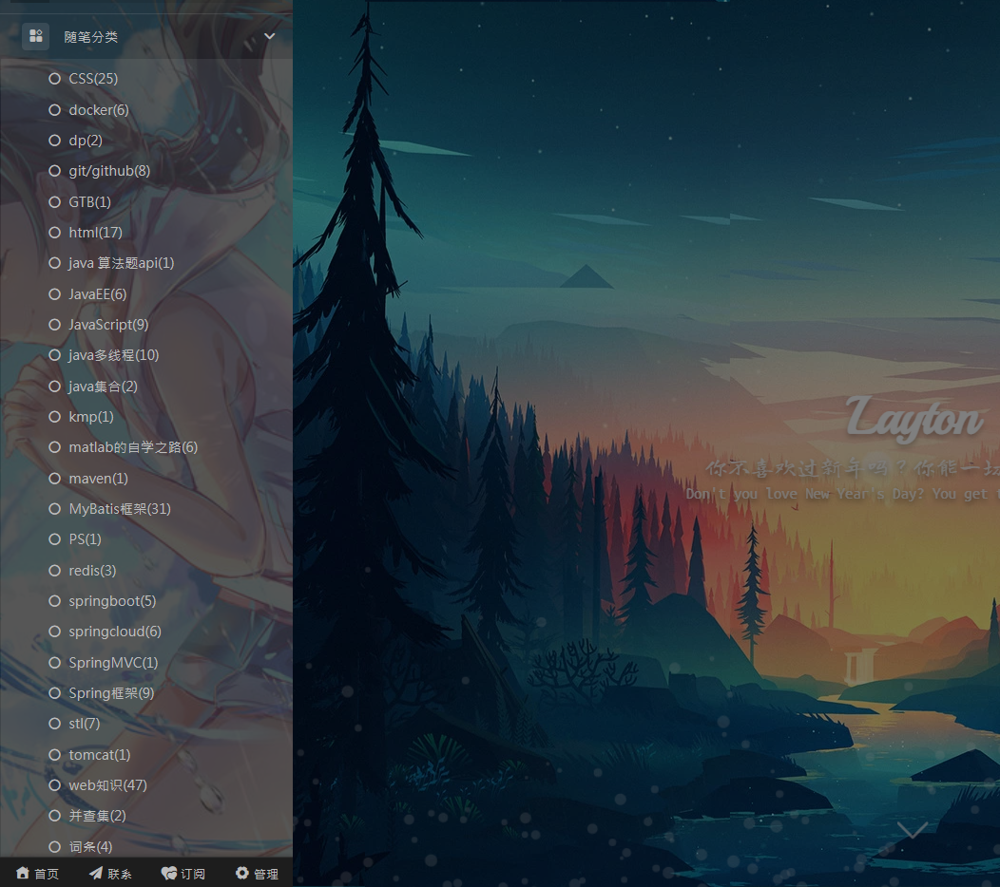
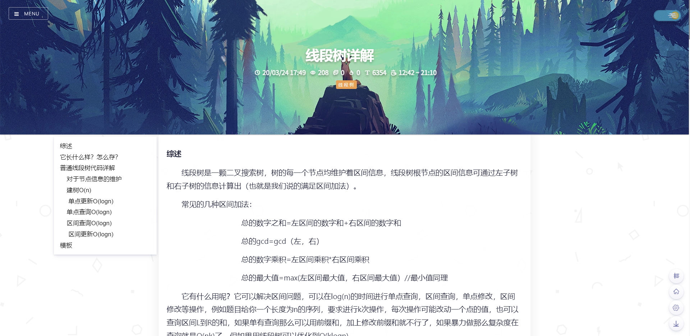

# Welcome to Layton's Org

我叫黄嘉骏,英文名是Layton

很可惜这里没有我的丑照&帅照

我喜欢写博客，这是我的博客地址:https://www.cnblogs.com/CNLayton/

你可以在随笔分类里查看我写的不同种类的博客

我是一名退役的ACMER，这是我花了两周时间才理解并写出的**线段树详解**(自豪.jpg)

我是广东外语外贸大学的学生，没想到吧，广外也是有计算机专业的

我最喜欢的游戏是雷顿教授，我的英文名Layton也是由此得来

希望未来能和各位优秀的同事相处愉快，希望GTB能学到更多的知识！
